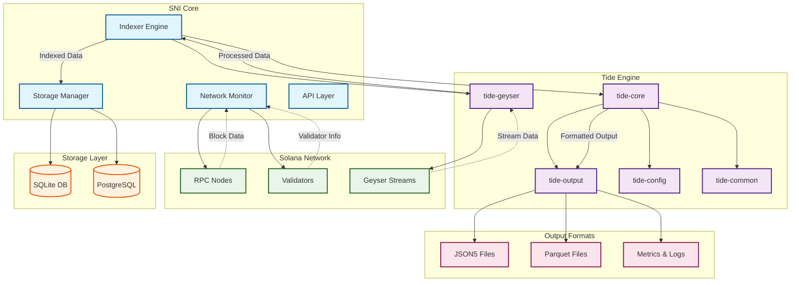

# 🌊 SNI - Solana Network Indexer

<div align="center">

[](https://www.rust-lang.org)
[](LICENSE)
[]()
[](https://solana.com)

**A fast Solana indexer powered by Tide engine**

[Features](#-features) • [Quick Start](#-quick-start) • [Architecture](#-architecture) • [Configuration](#-configuration) • [API Reference](#-api-reference)

</div>

---

## 🚀 Overview

SNI (Solana Network Indexer) is a high-performance blockchain indexer designed specifically for the Solana network. Built with Rust and powered by the innovative **Tide engine**, SNI provides real-time indexing capabilities with minimal latency and maximum throughput.

### Why SNI?

- ⚡ **Ultra-fast Processing**: Built on the Tide engine for maximum performance
- 🔄 **Real-time Indexing**: Live blockchain data streaming and processing
- 💾 **Flexible Storage**: SQLite support with planned PostgreSQL integration
- 🛡️ **Production Ready**: Robust error handling and comprehensive monitoring
- 🧩 **Modular Design**: Clean architecture with pluggable components
- 📊 **Rich Metrics**: Detailed performance and health monitoring

---

## ✨ Features

### Core Functionality
- 🏗️ **Block Processing**: Complete block data indexing with transaction details
- 💰 **Account Tracking**: Real-time account state changes and updates  
- 🔗 **Transaction Indexing**: Full transaction history with metadata
- 📈 **Slot Monitoring**: Slot progression and consensus tracking

### Performance & Reliability
- ⚡ **High Throughput**: Optimized for handling Solana's high TPS
- 🔄 **Automatic Recovery**: Resilient to network interruptions
- 📊 **Health Monitoring**: Comprehensive network and system health checks
- 🎯 **Smart Buffering**: Intelligent data buffering and batching

### Developer Experience
- 🛠️ **Easy Setup**: Simple configuration and deployment
- 📝 **Rich Logging**: Detailed tracing and debugging support
- 🔧 **CLI Interface**: Intuitive command-line tools
- 📖 **Comprehensive Docs**: Detailed documentation and examples

---

## 🏗️ Architecture

SNI is built on a modular architecture leveraging the powerful **Tide engine**:



### Key Components

- **🌊 Tide Engine**: Core processing engine providing high-performance data streaming
- **📡 Network Monitor**: Real-time network health and validator tracking
- **⚙️ Indexer Engine**: Main processing logic for blockchain data
- **💾 Storage Manager**: Flexible data persistence layer
- **🔧 Configuration**: Comprehensive configuration management

---

## 🚀 Quick Start

### Prerequisites

- **Rust 1.70+** - Install from [rustup.rs](https://rustup.rs/)
- **Git** - For cloning the repository

### Installation

1. **Clone the repository**
   ```bash
   git clone https://github.com/your-org/sni.git
   cd sni
   ```

2. **Build the project**
   ```bash
   cargo build --release
   ```

3. **Run health check**
   ```bash
   ./target/release/sni health
   ```

4. **Start indexing** (with default config)
   ```bash
   ./target/release/sni start
   ```

### Development Setup

For development with the Tide workspace:

```bash
# Navigate to the project directory
cd /path/to/your/windexer/sni

# Build with development dependencies
cargo build

# Run with debug logging
./target/debug/sni start --debug

# Check project status
cargo check
```

---

## ⚙️ Configuration

SNI uses TOML configuration files for easy customization:

### Basic Configuration (`sni.toml`)

```toml
[network]
rpc_url = "https://api.mainnet-beta.solana.com"
websocket_url = "wss://api.mainnet-beta.solana.com"
commitment = "confirmed"
timeout_seconds = 30

[storage]
database_url = "sqlite:sni.db"
batch_size = 1000
max_connections = 10

[indexer]
start_slot = "latest"
enable_account_indexing = true
enable_transaction_indexing = true
buffer_size = 10000

[logging]
level = "info"
file = "sni.log"
```

### Advanced Configuration

For production deployments, see [`config/production.toml`](config/production.toml) for advanced settings including:

- Custom RPC endpoints
- Performance tuning parameters
- Monitoring and alerting configuration
- Database optimization settings

---

## 📚 Usage Examples

### Basic Operations

```bash
# Check network connectivity
sni health

# Start indexing from latest slot
sni start

# Start with custom config
sni start --config custom.toml

# Enable debug logging
sni start --debug

# Show version information
sni version
```

### Programmatic Usage

```rust
use sni::{SolanaIndexer, config::SniConfig};

#[tokio::main]
async fn main() -> anyhow::Result<()> {
    // Load configuration
    let config = SniConfig::load("sni.toml")?;
    
    // Create and start indexer
    let mut indexer = SolanaIndexer::new(config).await?;
    indexer.start().await?;
    
    Ok(())
}
```

---

## 📊 Monitoring & Metrics

SNI provides comprehensive monitoring out of the box:

### Built-in Metrics

- **📈 Processing Stats**: Blocks, transactions, and accounts processed
- **⏱️ Performance**: Processing latency and throughput metrics  
- **🌐 Network Health**: RPC connectivity and validator status
- **💾 Storage**: Database size and query performance
- **🔄 System**: Memory usage and resource utilization

### Health Check Output

```
✅ Network Status:
   Current Slot: 245123456
   Current Epoch: 567
   Slot in Epoch: 123456/432000
   Solana Version: 1.18.22
   Block Lag: 2s
✅ Network is healthy and reachable

SNI Stats - Uptime: 3600s | Blocks: 1234 | Transactions: 45678 | Accounts: 12345 | Latency: 15ms
```

---

## 🛠️ Development

### Project Structure

```
sni/
├── src/
│   ├── main.rs          # CLI interface and application entry
│   ├── config.rs        # Configuration management
│   ├── indexer.rs       # Core indexing engine
│   ├── network.rs       # Network monitoring and RPC client
│   ├── storage.rs       # Data persistence layer
│   └── api.rs          # API endpoints (future)
├── config/             # Configuration templates
├── docs/              # Documentation
└── tests/             # Integration tests
```

### Building from Source

```bash
# Development build
cargo build

# Release build with optimizations
cargo build --release

# Run tests
cargo test

# Check code quality
cargo clippy
cargo fmt

# Generate documentation
cargo doc --open
```

### Running Tests

```bash
# Unit tests
cargo test --lib

# Integration tests
cargo test --test integration

# All tests with output
cargo test -- --nocapture
```

---

## 🤝 Contributing

We welcome contributions! Please see our [Contributing Guide](CONTRIBUTING.md) for details.

### Quick Contribution Steps

1. Fork the repository
2. Create a feature branch (`git checkout -b feature/amazing-feature`)
3. Make your changes
4. Add tests for new functionality
5. Run the test suite (`cargo test`)
6. Commit your changes (`git commit -m 'Add amazing feature'`)
7. Push to the branch (`git push origin feature/amazing-feature`)
8. Open a Pull Request

---

## 📋 Roadmap

### Current Version (v0.1.0)
- ✅ Basic block and transaction indexing
- ✅ SQLite storage backend
- ✅ Network health monitoring
- ✅ CLI interface

### Upcoming Features
- 🔄 **v0.2.0**: PostgreSQL support, enhanced metrics
- 🔄 **v0.3.0**: GraphQL API, advanced querying
- 🔄 **v0.4.0**: Distributed processing, horizontal scaling
- 🔄 **v0.5.0**: Real-time WebSocket API, pub/sub system

---

## 📄 License

This project is dual-licensed under:

- **Apache License 2.0** ([LICENSE](LICENSE) or http://www.apache.org/licenses/LICENSE-2.0)

You may choose either license at your option.

---

## 🙏 Acknowledgments

- **Solana Foundation** - For the overall support and amazing docs and platform
- **Tide Engine** - For the high-performance processing framework  
- **Rust Community** - For the incredible tools and ecosystem
- **Contributors** - For making this project better

---

## 📞 Support

- 📧 **Email**: vivek@windnetwork.ai
- 🐛 **Issues**: [GitHub Issues](https://github.com/wind-network/sni/issues)
- 📖 **Docs**: [Full Documentation](https://docs.windnetwork.ai/sni)

---

<div align="center">

**Built with ❤️ by the Wind Network team**

⭐ **Star this repo if you find it useful!** ⭐

</div> 